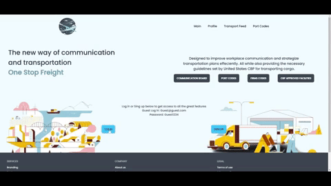

<div align="center">

  
  <h1>One Stop Freight</h1>
  
<p>A new way to communicate and inform agents of transportation schedule, space availability, and CBP information all in one space. </p>

<h2>Live Site: https://lazy-cyan-octopus-tie.cyclic.app </h2>
</div>

## :star2: About the Project
One Stop Freight is an application designed to be a new modern way of communication for agents in transportation and freight forwarding companies to track and communicate transportation schedules within different deparments within the company. Agents will post their scheduled booking information and allow other agents to add comments for the purpose of adding freight to a currently scheduled booking. In addition to communication via schedule posts, One Stop Freight's purpose is to be a site to get information needed in order to schedule and transort cargo. The port section provides the needed CBP required facililty information based on Port codes created with a RestAPI. 

### :camera: Media

 
### :space_invader: Tech Stack
  <ul>
    <li>JavaScript</li>
    <li>Node.js</li>
    <li>Express</li>
    <li>TailwindCSS</li>
    <li>DaisyUI</li>
    <li>RestAPI</li>
    <li>MongoDB</li>
    <li>Cylic</li>
    <li>Passport</li>
  </ul>

<!-- Usage -->
## :computer: How It's Made
<p>One Stop Freight is a full stack website that utilizes MVC organization to provide easy and efficient code organization. The main page allows the user to log in or sign up with user authenication with Passport to gain access to information that may be sensitive to companies. Users are able to see posts from all other users in the organization which was created using CRUD. The ability to post details about shipment transportation and schedule as well as comment on each post allows for easy communication between users. All information is safely stored on the MongoDB database with additional hash security to ensure the safety of user information and passcodes. The additional feature provided is the ability to quickly obtain necessary CBP information that is needed when transferring cargo to different facilites. This information has been accurately compared with U.S Customs and Border Protection which includes details of the facility, address, facility type, firms code, and more.</p>


<!-- Roadmap -->
## :compass: Roadmap

* [x] User Login Authenication
* [x] Post and Comment ability for all users 
* [x] RestAPI implementation for CBP facility info requirements
* [ ] Identify users with Avatar and id verification
* [ ] Flight and Vessel tracking based on Master Airwaybill / Bill of Lading


### :key: Environment Variables
`PORT` - Port Number to run locally

`DB_STRING` - Database String

<!-- Run Locally -->
## 	:toolbox: Run Locally

Clone the project

```bash
  git clone https://github.com/MazeBuer/OneStopFreight.git / or download Zip file
```

Go to the project directory

```bash
  cd OneStopFreight
```

Install dependencies

```bash
  npm install
```

Start the server

```bash
  npm start
```

<!-- Contact -->
## :handshake: Contact

Mazikeen Buer - [@twitter](https://twitter.com/Buer_Maze) - [@linkedin](https://www.linkedin.com/in/mazebuer)

